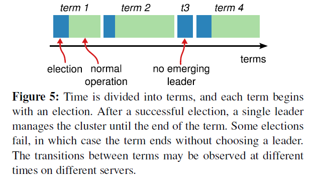
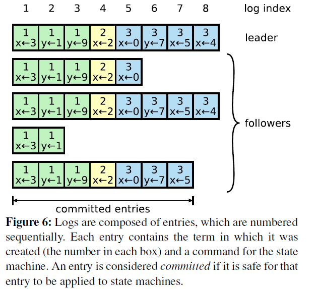
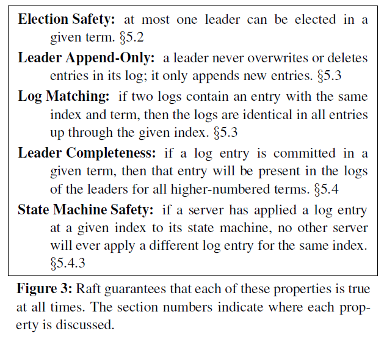
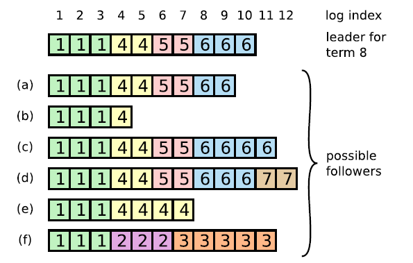
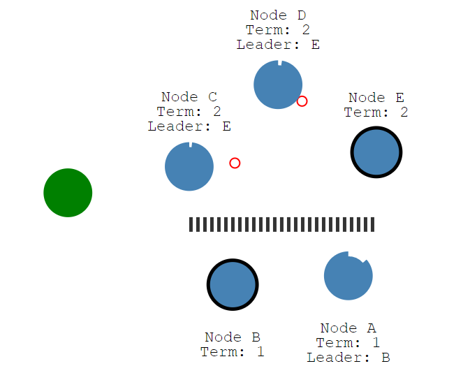

== Raft算法背景

Raft是一种共识算法，旨在替代Paxos。
它通过逻辑分离比Paxos更容易理解，但它也被正式证明是安全的，并提供了一些额外的功能（维基百科）。
它通过日志复制来实现的一致性，提供了和(多重)Paxos 算法相同的功能和性能，但是它的算法结构和 Paxos 是不同的，因此Raft 算法更容易理解和应用。
Raft 有几个关键模块：领导人选举、日志复制和安全性，同时它通过更强的一致性来减少算法状态的数量。
从用户研究的结果可以证明，对于学生而言，Raft 算法比 Paxos 算法更容易学习。
Raft 算法还允许集群成员的动态变更，它利用大多数原则来保证安全性。

== Raft算法简介
Raft协议主要有三种角色：

Leader（领导者）
Follower（跟随者）
Candidate（候选人）
每个服务器节点会在这三种状态之间通过特定条件不断变换：
跟随者只响应来自其他服务器的请求。如果跟随者接收不到消息，那么他就会变成候选人并发起一次选举。
获得集群中大多数选票的候选人将成为领导者。领导人一直都会是领导人直到自己宕机了。
Raft算法论文主要分为三部分进行描述论证：领导人选举、日志复制、安全性。

image::../image/relation.png[]

可以看出所有节点启动时都是follower状态；在一段时间内如果没有收到来自leader的心跳，从follower切换到candidate，发起选举；
如果收到majority的造成票（含自己的一票）则切换到leader状态；如果发现其他节点比自己更新，则主动切换到follower。

=== 领导者选举

领导者选举主要按照如下原则进行。

1. 任期用连续的整数标记。
2. 每一段任期从一次选举开始，一个或者多个候选人尝试成为领导者。有可能存在一个任期会以没有领导人结束，但一个新的任期（和一次新的选举）会很快重新开始。
3. 每个候选人、跟随者都有投票权，且每个投票者只能投票给那些日志与自身一样或更新的候选人（这称之为选举限制，与后面的日志复制与安全性论证有关）
4. 获取多数投票的候选人成为当前任期的领导者，然后他会向其他的服务器发送心跳消息来建立自己的权威并且阻止新的领导人的产生。
5. Raft采用随机数的方式，使得服务器由“跟随者”变为“候选人”无规律性，从而加速领导人的选出。
6. Raft 保证了在一个给定的任期内，最多只有一个领导者。

term（任期）以选举（election）开始，然后就是一段或长或短的稳定工作期（normal Operation）。
从上图可以看到，任期是递增的，这就充当了逻辑时钟的作用；另外，term 3展示了一种情况，就是说没有选举出leader就结束了，
然后会发起新的选举，后面会解释这种split vote的情况。

第一种情况，赢得了选举之后，新的leader会立刻给所有节点发消息，广而告之，避免其余节点触发新的选举。
在这里，先回到投票者的视角，投票者如何决定是否给一个选举请求投票呢，有以下约束：

1. 在任一任期内，单个节点最多只能投一票

2. 候选人知道的信息不能比自己的少

3. first-come-first-served 先来先得

第二种情况，比如有三个节点A B C。A B同时发起选举，而A的选举消息先到达C，C给A投了一票，
当B的消息到达C时，已经不能满足上面提到的第一个约束，即C不会给B投票，而A和B显然都不会给对方投票。
A胜出之后，会给B,C发心跳消息，节点B发现节点A的term不低于自己的term，知道有已经有Leader了，于是转换成follower。

第三种情况，没有任何节点获得majority投票，比如下图这种情况：

image::../image/majority.png[]

总共有四个节点，Node C、Node D同时成为了candidate，进入了term 4，
但Node A投了NodeD一票，NodeB投了Node C一票，这就出现了平票 split vote的情况。
这个时候大家都在等啊等，直到超时后重新发起选举。
如果出现平票的情况，那么就延长了系统不可用的时间（没有leader是不能处理客户端写请求的），
因此raft引入了randomized election timeouts来尽量避免平票情况。
同时，leader-based 共识算法中，节点的数目都是奇数个，尽量保证majority的出现。

=== 日志复制

一旦一个领导人被选举出来，他就开始为客户端提供服务，且Raft算法主要靠日志执行。其中日志复制的主要原则如下：

1. 客户端每一个请求都被领导人作为一条新的日志条目附加到日志中去，然后的发起附加条目 RPCs 给其他的服务器，让他们复制这条日志条目。
只有领导者有权发送复制日志的指令给其他服务器。

2. 在领导者将创建的日志条目复制到大多数的服务器上的时候，领导者就可以决定将其进行提交，只有被提交的日志才会被认为是有效的并最终返回给客户端。

3. 在非领导者服务器上的未提交日志，可能被新领导者发送来的日志删除并覆盖，所以存在丢失未提交日志的情况。

4. 领导者从来不会覆盖或者删除自己的日志，只会在变为跟随者时（通常因为失联、崩溃等异常情况后再恢复才会变为跟随者）才可能被覆盖未提交的日志。

5. 只有领导人当前任期的日志条目才能通过计算数目来进行提交。一旦当前任期的日志条目以这种方式被提交，
那么由于日志匹配原则（Log Matching Property），之前的日志条目也都会被间接的提交。（这称之为提交之前任期内的日志条目，与后面的安全性论证有关）

6. 这个日志复制机制展示了Raft的一致性特性：只要大部分的服务器是正常的，Raft 能够接受、复制并且应用新的日志条目。
在通常情况下，一条新的日志条目可以在一轮 RPC 内完成在集群的大多数服务器上的复制；并且一个速度很慢的追随者并不会影响整体的性能。

不难看到，logs由顺序编号的log entry组成 ，每个log entry除了包含command，还包含产生该log entry时的leader term。
从上图可以看到，五个节点的日志并不完全一致，raft算法为了保证高可用，并不是强一致性，而是最终一致性，leader会不断尝试给follower发log entries，直到所有节点的log entries都相同。

  在上面的流程中，leader只需要日志被复制到大多数节点即可向客户端返回，一旦向客户端返回成功消息，那么系统就必须保证log（其实是log所包含的command）在任何异常的情况下都不会发生回滚。
这里有两个词：commit（committed），apply(applied)，前者是指日志被复制到了大多数节点后日志的状态；而后者则是节点将日志应用到状态机，真正影响到节点状态。

=== 安全性

安全性的论证部分主要是通过以下两个前面提到限制规则来保证算法的安全性：
1. 选举限制
2. 提交之前任期内的日志条目

==== Election safety

选举安全性，即任一任期内最多一个leader被选出。 这一点非常重要，在一个复制集中任何时刻只能有一个leader。系统中同时有多余一个leader，被称之为脑裂（brain split），
这是非常严重的问题，会导致数据的覆盖丢失。在raft中，两点保证了这个属性：

1. 一个节点某一任期内最多只能投一票；
2. 只有获得majority投票的节点才会成为leader。

因此，某一任期内一定只有一个leader。

==== log matching

log匹配特性， 就是说如果两个节点上的某个log entry的log index相同且term相同，那么在该index之前的所有log entry应该都是相同的。依赖于以下两点

1. 首先，leader在某一term的任一位置只会创建一个log entry，且log entry是append-only。
2. 其次，consistency check。leader在AppendEntries中包含最新log entry之前的一个log 的term和index，如果follower在对应的term index找不到日志，那么就会告知leader不一致。

在没有异常的情况下，log matching是很容易满足的，但如果出现了node crash，情况就会变得负责。比如下图

注意：上图的a-f不是6个follower，而是某个follower可能存在的六个状态

leader、follower都可能crash，那么follower维护的日志与leader相比可能出现以下情况

比leader日志少，如上图中的ab

比leader日志多，如上图中的cd

某些位置比leader多，某些日志比leader少，如ef（多少是针对某一任期而言）

当出现了leader与follower不一致的情况，leader强制follower复制自己的log

leader会维护一个nextIndex[]数组，记录了leader可以发送每一个follower的log index，初始化为leader最后一个log index加1，
前面也提到，leader选举成功之后会立即给所有follower发送AppendEntries RPC（不包含任何log entry， 也充当心跳消息）,那么流程总结为：

s1 leader 初始化nextIndex[x]为 leader最后一个log index + 1

s2 AppendEntries里prevLogTerm prevLogIndex来自 logs[nextIndex[x] - 1]

s3 如果follower判断prevLogIndex位置的log term不等于prevLogTerm，那么返回 False，否则返回True

s4 leader收到follower的回复，如果返回值是False，则nextIndex[x] -= 1, 跳转到s2. 否则

s5 同步nextIndex[x]后的所有log entries

#### leader completeness vs election restriction

leader完整性：如果一个log entry在某个任期被提交（committed），那么这条日志一定会出现在所有更高term的leader的日志里面。这个跟leader election、log replication都有关。

一个日志被复制到majority节点才算committed

一个节点得到majority的投票才能成为leader，而节点A给节点B投票的其中一个前提是，B的日志不能比A的日志旧

==== corner case

raft保证Election safety，即一个任期内最多只有一个leader，但在网络分割（network partition）的情况下，可能会出现两个leader，但两个leader所处的任期是不同的。如下图所示

系统有5个节点A、B、C、D、E组成，在term1，Node B是leader，但Node A、B和Node C、D、E之间出现了网络分割，因此Node C、D、E无法收到来自leader（Node B）的消息，
在election time之后，Node C、D、E会分期选举，由于满足majority条件，Node E成为了term 2的leader。
因此，在系统中貌似出现了两个leader：term 1的Node B， term 2的Node E, Node B的term更旧，但由于无法与Majority节点通信，NodeB仍然会认为自己是leader。

在这样的情况下，我们来考虑读写。

首先，如果客户端将请求发送到了NodeB，NodeB无法将log entry 复制到majority节点，因此不会告诉客户端写入成功，这就不会有问题。

对于读请求，stale leader可能返回stale data，比如在read-after-write的一致性要求下，客户端写入到了term2任期的leader Node E，
但读请求发送到了Node B。如果要保证不返回stale data，leader需要check自己是否过时了，办法就是与大多数节点通信一次，这个可能会出现效率问题。另一种方式是使用lease，但这就会依赖物理时钟。

从raft的论文中可以看到，leader转换成follower的条件是收到来自更高term的消息，如果网络分割一直持续，那么stale leader就会一直存在。
而在raft的一些实现或者raft-like协议中，leader如果收不到majority节点的消息，那么可以自己step down，自行转换到follower状态。

==== State Machine Safety

如果节点将某一位置的log entry应用到了状态机，那么其他节点在同一位置不能应用不同的日志。简单点来说，所有节点在同一位置（index in log entries）应该应用同样的日志。但是似乎有某些情况会违背这个原则：

image::../image/state_safety.png[]

上图是一个较为复杂的情况。在时刻(a), s1是leader，在term2提交的日志只赋值到了s1 s2两个节点就crash了。在时刻（b), s5成为了term 3的leader，日志只赋值到了s5，然后crash。然后在(c)时刻，s1又成为了term 4的leader，
开始赋值日志，于是把term2的日志复制到了s3，此刻，可以看出term2对应的日志已经被复制到了majority，因此是committed，可以被状态机应用。不幸的是，接下来（d）时刻，s1又crash了，s5重新当选，
然后将term3的日志复制到所有节点，这就出现了一种奇怪的现象：被复制到大多数节点（或者说可能已经应用）的日志被回滚。

究其根本，是因为term4时的leader s1在（C）时刻提交了之前term2任期的日志。为了杜绝这种情况的发生：

某个leader选举成功之后，不会直接提交前任leader时期的日志，而是通过提交当前任期的日志的时候“顺手”把之前的日志也提交了，具体怎么实现了，在log matching部分有详细介绍。
那么问题来了，如果leader被选举后没有收到客户端的请求呢，论文中有提到，在任期开始的时候发立即尝试复制、提交一条空的log

因此，在上图中，不会出现（C）时刻的情况，即term4任期的leader s1不会复制term2的日志到s3。
而是如同(e)描述的情况，通过复制-提交 term4的日志顺便提交term2的日志。如果term4的日志提交成功，那么term2的日志也一定提交成功，此时即使s1crash，s5也不会重新当选。

=== 演示网址
http://thesecretlivesofdata.com/raft/

=== 论文网址
https://www.cnblogs.com/xybaby/p/10124083.html

https://web.stanford.edu/~ouster/cgi-bin/papers/raft-atc14